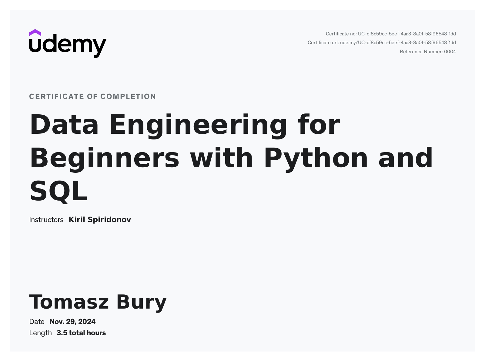

[Data Engineering for Beginners with Python and SQL](https://nordea.udemy.com/course/data-engineering-for-beginners-with-python-and-sql/?src=sac&kw=Python+for+data+engineering)  

[diagrams](https://app.diagrams.net)

- [Back to Main README](/README.md)